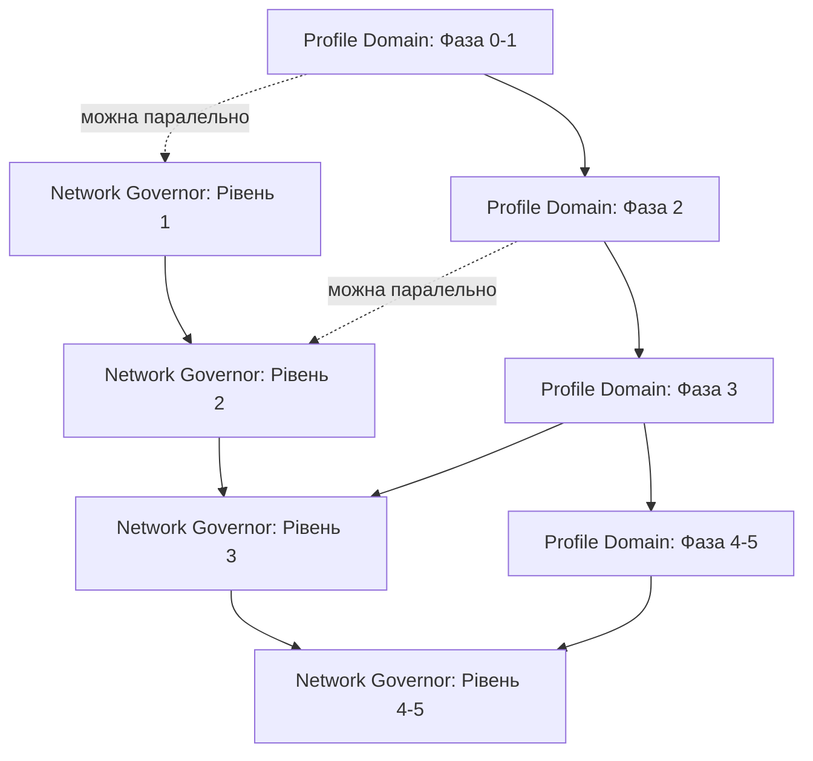

# Implementation Roadmap: Tutor Profile Domain + Network Governor

**Дата:** 2026-02-01  
**Версія:** v1.0.0  
**Статус:** APPROVED

---

## Executive Summary

Цей roadmap визначає порядок впровадження двох критичних архітектурних систем:

1. **Tutor Profile Domain** — єдине джерело правди для профілю тьютора
2. **5-Level Network Governor** — контроль мережевих запитів

**Загальний час:** ~39 годин (5 робочих днів для агента)

---

## Пріоритизація: Що робити першим?

### Рекомендація: **ПАРАЛЕЛЬНО** (з пріоритетом на Profile Domain)

**Обґрунтування:**

1. **Profile Domain (P0)** — блокує Marketplace release
   - Без нього неможливо гарантувати консистентність даних
   - Кожна зміна профілю ризикує зламати Marketplace
   - Це фундамент для всіх майбутніх фіч

2. **Network Governor (P1)** — покращує UX, але не блокує release
   - Поточні виправлення (refresh backoff, polling guard) вже зменшили критичність
   - Можна впроваджувати поетапно (пасивний режим → enforced)
   - Не впливає на бізнес-логіку

**Стратегія:**
```
Week 1: Profile Domain (Фази 0-2) + Network Governor (Рівень 1-2, пасивний)
Week 2: Profile Domain (Фази 3-5) + Network Governor (Рівень 3, enforced)
Week 3: Network Governor (Рівні 4-5) + Integration Tests
```

---

## Залежності між планами



**Критична залежність:**
- Profile Domain Фаза 3 (міграція) **ПОВИННА** завершитись перед Network Governor Рівень 3 (Auth State Machine)
- Причина: Auth State Machine впливає на те, як компоненти читають профіль

---

## Детальний Timeline

### Week 1: Фундамент

#### Day 1 (8 годин)

**Ранок (4 год):**
- ✅ Profile Domain: Фаза 0 (підготовка) — 1 год
- ✅ Profile Domain: Фаза 1 (структура + модель) — 2 год
- ✅ Code review + тести — 1 год

**День (4 год):**
- ✅ Network Governor: Рівень 1 (Request Governor, пасивний) — 3 год
- ✅ Code review + тести — 1 год

**Deliverables:**
- `src/domains/tutorProfile/` структура створена
- `src/core/network/requestGovernor.ts` у пасивному режимі
- Логи показують класифікацію запитів

---

#### Day 2 (8 годин)

**Ранок (4 год):**
- ✅ Profile Domain: Фаза 2 (Public API) — 4 год

**День (4 год):**
- ✅ Network Governor: Рівень 2 (Endpoint Classifier, пасивний) — 4 год

**Deliverables:**
- `tutorProfile.get/init/update/publish` працюють
- Endpoint'и класифікуються автоматично
- Метрики збираються

---

#### Day 3 (8 годин)

**Ранок (4 год):**
- ✅ Profile Domain: Фаза 3.1 (міграція marketplaceStore) — 3 год
- ✅ Тести — 1 год

**День (4 год):**
- ✅ Profile Domain: Фаза 3.2 (міграція ProfileEditor) — 2 год
- ✅ Profile Domain: Фаза 3.3 (Marketplace read-only) — 2 год

**Deliverables:**
- `marketplaceStore` використовує domain API
- `ProfileEditor` використовує domain API
- Всі компоненти читають через `tutorProfile.get()`

**⚠️ Критична точка:** Після цього дня Profile Domain стає SSOT

---

### Week 2: Enforced режим

#### Day 4 (8 годин)

**Ранок (4 год):**
- ✅ Profile Domain: Фаза 4 (захист) — 2 год
- ✅ Profile Domain: Фаза 5 (фіксація) — 2 год

**День (4 год):**
- ✅ Network Governor: Рівень 1-2 (увімкнути enforced) — 2 год
- ✅ Network Governor: Рівень 3 (Auth State Machine) — 2 год

**Deliverables:**
- DEV freeze працює для профілю
- ESLint rules додані
- Request Governor блокує запити
- `authState` замість boolean

**⚠️ Критична точка:** Після цього дня Network Governor активний

---

#### Day 5 (7 годин)

**Ранок (4 год):**
- ✅ Network Governor: Рівень 3 (завершення Auth State Machine) — 3 год
- ✅ Інтеграція з Profile Domain — 1 год

**День (3 год):**
- ✅ Network Governor: Рівень 4 (Polling Manager) — 3 год

**Deliverables:**
- Auth State Machine повністю працює
- Polling централізований
- Backoff на 429 працює

---

### Week 3: Фінал

#### Day 6 (4 години)

**Ранок (4 год):**
- ✅ Network Governor: Рівень 5 (Marketplace Fetch Queue) — 3 год
- ✅ Integration tests — 1 год

**Deliverables:**
- Marketplace fetch queue працює
- Cancel previous працює
- Всі 5 рівнів активні

---

#### Day 7 (4 години)

**Ранок (4 год):**
- ✅ Integration tests (продовження) — 2 год
- ✅ Документація — 1 год
- ✅ Final review — 1 год

**Deliverables:**
- Всі тести проходять
- Документація оновлена
- CI/CD налаштовано

---

## Acceptance Criteria (загальні)

### Profile Domain

- [ ] Всі компоненти використовують domain API
- [ ] Немає прямих мутацій профілю
- [ ] DEV freeze працює
- [ ] ESLint ловить заборонені імпорти
- [ ] Тести покривають 80%+
- [ ] Marketplace працює без регресій
- [ ] CI/CD перевіряє правила

### Network Governor

- [ ] Всі 5 рівнів реалізовані
- [ ] Інваріанти виконуються:
  - `429 ≠ logout` ✅
  - `BACKGROUND ≠ auth breaker` ✅
  - `Polling ≠ early` ✅
  - `Auth ≠ boolean` ✅
  - `Request ≠ без дозволу` ✅
- [ ] Немає refresh-циклів
- [ ] Немає self-DDoS
- [ ] Тести покривають всі рівні
- [ ] CI/CD перевіряє

---

## Ризики та мітігація

### Високий ризик

| Ризик | Вплив | Мітігація | Відповідальний |
|-------|-------|-----------|----------------|
| Profile Domain ламає Marketplace | Критичний | Поетапна міграція + тести після кожної фази | Agent |
| Auth State Machine ламає login | Критичний | Пасивний режим спочатку, extensive tests | Agent |
| Конфлікт між Domain та Governor | Високий | Чітка послідовність: Domain → Governor | Agent |

### Середній ризик

| Ризик | Вплив | Мітігація | Відповідальний |
|-------|-------|-----------|----------------|
| Performance regression | Середній | Benchmarks до/після | Agent |
| Складність підтримки | Середній | Документація + training | Agent |
| Team resistance | Середній | Чіткі правила + демо | User |

---

## Rollback Plan

### Якщо Profile Domain не працює

**Після Фази 2:**
- Можна відкотити без впливу на UI
- Просто не використовувати domain API

**Після Фази 3:**
- Складніше, треба повертати refs у stores
- Час: ~2 години

**Після Фази 4:**
- Дуже складно, треба видаляти ESLint rules + freeze
- Час: ~4 години

**Рекомендація:** Не йти далі Фази 3 без повного тестування

### Якщо Network Governor не працює

**Після Рівня 2 (пасивний):**
- Просто вимкнути, без впливу
- Час: 10 хвилин

**Після Рівня 3 (enforced):**
- Повернути `isAuthenticated` на boolean
- Вимкнути blocking у governor
- Час: ~1 година

**Після Рівня 5:**
- Повернути децентралізований polling
- Видалити fetch queue
- Час: ~3 години

**Рекомендація:** Тримати пасивний режим мінімум 1 день перед enforced

---

## Метрики успіху

### Profile Domain

| Метрика | До | Після | Ціль |
|---------|-----|-------|------|
| Кількість stores з профілем | 2 | 1 (domain) | 1 |
| Прямі мутації | 10+ | 0 | 0 |
| Test coverage | 30% | 80%+ | 80% |
| Регресії Marketplace | ? | 0 | 0 |

### Network Governor

| Метрика | До | Після | Ціль |
|---------|-----|-------|------|
| Refresh-цикли | Часто | 0 | 0 |
| Self-DDoS інциденти | 2-3/день | 0 | 0 |
| 429 → logout | Так | Ні | Ні |
| BACKGROUND → logout | Так | Ні | Ні |

---

## Наступні кроки після завершення

### Короткострокові (1-2 тижні)

1. **Monitoring та telemetry**
   - Додати метрики для domain operations
   - Додати метрики для network governor
   - Dashboard у Grafana/Datadog

2. **Performance optimization**
   - Benchmarks для domain API
   - Benchmarks для network layer
   - Оптимізація якщо потрібно

3. **Documentation**
   - Onboarding guide для нових розробників
   - Architecture decision records (ADRs)
   - Runbook для production issues

### Середньострокові (1-2 місяці)

1. **Profile Domain розширення**
   - Snapshot versioning
   - Conflict resolution
   - Optimistic updates

2. **Network Governor розширення**
   - Circuit breaker
   - Retry policies
   - Request prioritization

3. **Marketplace release**
   - Public beta
   - A/B testing
   - Gradual rollout

### Довгострокові (3-6 місяців)

1. **Інші domains**
   - Lessons Domain
   - Booking Domain
   - Billing Domain

2. **Platform patterns**
   - Domain-driven design для всіх модулів
   - Unified network layer
   - Shared validation framework

---

## Висновки

### Що ми отримаємо

**Profile Domain:**
- ✅ Єдине джерело правди для профілю
- ✅ Неможливість випадкових мутацій
- ✅ Гарантована консистентність
- ✅ Простота тестування
- ✅ Можливість розширення без регресій

**Network Governor:**
- ✅ Немає refresh-циклів
- ✅ Немає self-DDoS
- ✅ Централізований контроль
- ✅ Чіткі інваріанти
- ✅ Production-ready архітектура

### Чому це важливо

Згідно з **Законом фундаменту** (з маніфесту):

> Ми будуємо не фічі. Ми будуємо платформу.

Ці два плани — це **фундамент**, а не фічі:

1. **Profile Domain** — фундамент для всіх операцій з профілем
2. **Network Governor** — фундамент для всіх мережевих запитів

Без цих фундаментів неможливо:
- Гарантувати якість
- Масштабувати команду
- Додавати нові фічі без регресій
- Виходити на production з впевненістю

### Готовність до старту

**Profile Domain:** ✅ READY  
**Network Governor:** ✅ READY  
**Roadmap:** ✅ APPROVED  

**Можна починати реалізацію.**

---

## Додатки

### A. Посилання на документи

- [Tutor Profile Domain Audit](./TUTOR_PROFILE_DOMAIN_AUDIT.md)
- [Tutor Profile Domain Plan](./TUTOR_PROFILE_DOMAIN_PLAN.md)
- [Network Layer Audit](./NETWORK_LAYER_AUDIT.md)
- [Network Governor 5-Level Plan](./NETWORK_GOVERNOR_5LEVEL_PLAN.md)

### B. Контакти

- **Tech Lead:** User
- **Implementation Agent:** Cascade AI
- **Code Review:** User + Cascade AI

### C. Changelog

- **2026-02-01:** Initial roadmap created
